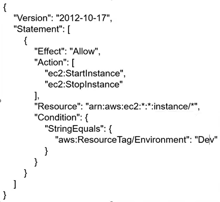

## Mục Lục
- [Tổng quan các service trên AWS ](#tong-quan-cac-service-tren-aws)
- [Cách sử dụng](#cach-su-dung)
- [Kết luận](#ket-luan)


## EC2

## IAM
- User
- Role
- Group
- Policy

<strong>Policy</strong>
Policy có thể gán vào Role, Group và User
Một policy thường bao gồm nhiều statement quy định các action (Allow/Deny) trên các resource dựa vào condition.
Mỗi statement bao gồm các thông tin: 
- <strong>Effect</strong>: có 2 loại là Allow và Deny.
- <strong>Action</strong>: tập hợp các action được cho phép thực thi.
- <strong>Resource</strong>: tập hợp các resource cho phép tương tác.
- <strong>Condition (optional)</strong>: Điều kiện kèm theo để apply statement này. 
Policy có 2 loại là: Inline Policy và  Managed Policy
- <strong>Inline policy</strong>: được gán trực tiếp lên Role/User/Group và không thể tái sử dụng ở Role/User/Group khác.
- <strong>Managed Policy</strong>: Được tạo riêng và có thể gắn vào nhiều
User/Group/Role.

Managed Policy lại được chia thành 2 loại là <strong>AWS Managed (policy do AWS được thiết kế sẵn)</strong>  và <strong>User Managed (các policy do ta tự custom)</strong> .
Việc lựa chọn giữa Inline vs Managed phải được tính toán dựa trên các yếu tố như: tính tái sử dụng, quản lý thay đổi tập trung, versioning & rollback.

Ví dụ 1 IAM Policy như sau:



Policy trên quy định đối tượng được gán policy này được phép thực hiện 2 hành động là StartInstance và StopInstance trên toàn bộ các EC2 instance với điều kiện instance đó có 1 thẻ tag tên <strong>Environment</strong> và giá trị là <strong>Dev</strong>.

<strong>User</strong>
Đại diện cho 1 profile của 1 người dùng trên AWS Account.
User có thể login vào AWS Console sử dụng username/password.
User mặc định khi tạo ra sẽ không có quyền gì. Cần cấp quyền cho user thông qua Policy.
User có thể phát hành access-key/secret-key để sử dụng cho CLI hoặc test SDK trong quá trình test code. Cặp access/secret key này cũng đại diện cho user (thay vì dụng cặp username/password)

<strong>Role</strong>
Sử dụng khi muốn cấp quyền cho 1 thực thể có thể tương tác với các resources khác trên AWS. Thường dùng để gắn vào EC2, Lambda, Container,...
Có thể sử dụng để cấp quyền cho 1 user nằm ở AWS account khác mà không muốn tạo ra user profile cho họ trên account AWS của mình. Bằng cách cho phép 1 user <strong>assume-role</strong> (tạm thời nhận quyền của một IAM Role khác) tới 1 role trên account, user có thể có các quyền tạm thời để thực hiện thao tác.
*Lưu ý: một resource trên AWS không thể tương tác với resource khác nếu không được gán Role với các quyền thích hợp. Đây cũng chính là lý do khiến cho việc Role & Permission khiến cho mọi người tốn thời gian trouble shooting nếu không nắm rõ dịch vụ mà mình đang sử dụng. 

<strong>Group</strong>
Đại diện cho 1 nhóm user trên hệ thống.
Sử dụng khi muốn phân chia quyền dựa theo vai trò trong dự án, phòng ban,...
Nên thiết kế các nhóm user và phân quyền hợp lý, sau đó khi có người mới chúng ta chỉ cần add user đó vào các nhóm cần thiết giúp tiết kiệm thời gian và tránh sai sót (cấp dư hoặc thiếu quyền).
Lưu ý tránh bị chồng chéo quyền (vd 1 group allow action A nhưng group khác lại deny action A).
Một group không thể chứa group khác (lồng nhau).
Một user có thể không thuộc group nào hoặc thuộc nhiều groups.
Một group có thể không có user nào hoặc có nhiều users.

### AWS CLI
Ngoài việc tương tác với các service bằng console, ta có thể sử dụng AWS CLI để thực hiện các thao tác tương tự. Trước hết, ta phải tạo cặp <strong>access-key</strong> và <strong>secret-key</strong> ở user ta muốn sử dụng AWS CLI. Đối với root user, ta không nên sử dụng access key vì khó có thể quản lý ai đang sử dụng access key và dùng với mục đích gì. Vì vậy, ta nên tạo IAM User và cấp những quyền phù hợp, ta có thể sử dụng Root User để cấp access key cho 1 IAM User cụ thể hoặc bản thân IAM User có thể tự tạo access key.
Để tạo access key ta cần sử dụng AWS Console để thao tác, sau khi có access key, ta tiến hành xác thực bằng lệnh như sau:
```python
#Cấu hình thông tin xác thực
aws configure

#Test credential
aws sts get-caller-identity
```
Sau khi xác thực thành công, ta có thể sử dụng các lệnh để thao tác với các service.

```python
#List object in bucket
aws s3 ls s3://<bucket-name>

#Download file
aws s3 cp <s3 uri> <local dest>

#Upload file
aws s3 cp <local dest> <s3 uri>
```
Ngoài ra, khi account sử dụng MFA mà ta muốn sử dụng CLI, ta cần phải thực hiện các thao tác sau:
```python
#Step 1:    Lệnh xác thực, nhập arn của mfa device và token của authentication app
aws sts get-session-token --serial-number arn-of-the-mfa-device --token-code code-from-token

#Step 2: config credential file.
"C:\Users\<your user name>\.aws\credentials"
#--------------------
[<MFA-name>]
aws_access_key_id = <your-access-key-id>
aws_secret_access_key = <your-secret-access-key>
aws_session_token = <your-session-token>
#-------------

#Step 3: specify --profile when run command.
aws s3 ls --profile <MFA-name>
aws s3 ls s3://<your-bucket-name>/ --profile <MFA-name>
```